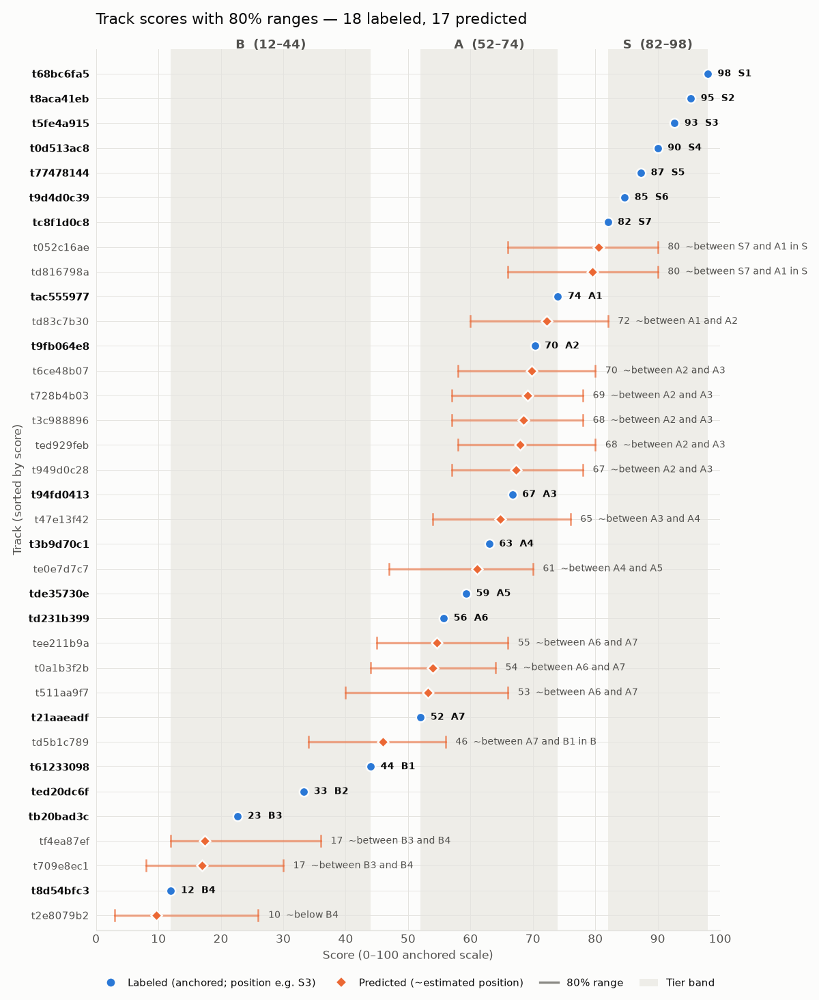

# Blind taste prediction — report

35 instrumental tracks with random ids. You ranked 18 into S / A / B, with an order inside each tier. The other 17
were placed without anyone hearing them: every track was analysed into a text "packet" and described in
listening notes. A taste profile was built from your ranking, tested, and then used to slot the 17 into your
order. Nobody tried to identify any track or artist.

## What the collection sounds like

It's mostly **instrumental electronic and beat music with a night-time lean**: club and house grooves, lo-fi and
trap beats, synthwave and game-style synth rushes. Around that there's a ring of **cinematic and ambient pieces**
(strings, music-box and harp miniatures, new-age loops) and a couple of **heavy band tracks**. Most tracks are
short (1–4 min), loop-based and have no singable tune. They live on mood, groove and texture.

One line per track, in the combined order (★ = your label, ◇ = predicted):

| # | id | | sounds like |
|---|---|---|---|
| S1 | t68bc6fa5 | ★ | slick, upbeat trance/EDM: filtered intro, big drop, a happy lift, then a breakdown |
| S2 | t8aca41eb | ★ | cool, moody broken-beat house groove, tight drums, one catchy hook mid-track |
| S3 | t5fe4a915 | ★ | heavy, dark wall of guitars crashing in after a quiet intro; grinding, then emotional |
| S4 | t0d513ac8 | ★ | short, dark, restless breakbeat piece: a drums-only break, then a yearning, film-like middle |
| S5 | t77478144 | ★ | calm, cinematic strings and twinkling piano, slow swell, no drums |
| S6 | t9d4d0c39 | ★ | warm, hypnotic downtempo with a sparkling pattern and floating drumless breaks |
| S7 | tc8f1d0c8 | ★ | sparse, dark 2 a.m. trip-hop, muffled keys, a near-silent drop |
| S8 | t052c16ae | ◇ | dark, velvety synth groove, hazy and hypnotic, a dreamy lift halfway, abrupt stop |
| S9 | td816798a | ◇ | glossy future-bass drops after a long muffled intro, bittersweet twist in the second drop |
| A1 | tac555977 | ★ | fast anime-action synth-rock, exciting but one level throughout |
| A2 | td83c7b30 | ◇ | 80s night-drive synthwave, bubbling bass, a singing lead in the darker middle |
| A3 | t9fb064e8 | ★ | polished, bittersweet club house: one hook loop for 2.5 minutes |
| A4 | t6ce48b07 | ◇ | wistful lo-fi hip-hop that sinks "underwater", then a heavy slow 808 stretch |
| A5 | t728b4b03 | ◇ | sad, glossy trap beat, very loud and even, with a late switch to a brighter groove |
| A6 | t3c988896 | ◇ | muffled-intro night hip-hop, 808, chords drifting darker |
| A7 | ted929feb | ◇ | wistful, sighing guitar loop over a steady beat, twinkly piano, a slowdown at the end |
| A8 | t949d0c28 | ◇ | smooth "rooftop" house, walking bass, catchy repeated phrase |
| A9 | t94fd0413 | ★ | slow, nodding hip-hop beat with a sudden bright detour mid-track |
| A10 | t47e13f42 | ◇ | bleepy retro chiptune-style game tune: build, drop, build; very loud |
| A11 | t3b9d70c1 | ★ | loud, fast video-game synth loop, bending lead, harsh-sounding copy |
| A12 | te0e7d7c7 | ◇ | bright, heroic game-chase synth rush with a big late lift |
| A13 | tde35730e | ★ | music-box opening swelling to a heroic anime-film climax |
| A14 | td231b399 | ★ | loud, dusty sample-style hip-hop loop, three near-identical rounds |
| A15 | tee211b9a | ◇ | dark, loud lo-fi trap beat, stuttering chopped-voice lead, one pattern for 3.5 min |
| A16 | t0a1b3f2b | ◇ | warm, melancholy study-playlist hip-hop loop, deep bass, one cycle throughout |
| A17 | t511aa9f7 | ◇ | 75-second chiming picked-guitar vignette over live drums, a late lift |
| A18 | t21aaeadf | ★ | relaxed late-night small band (sax-like lead, big bass), drumless middle |
| B1 | td5b1c789 | ◇ | cheerful 90-second anime-opening bounce, bright keys, one wistful turn |
| B2 | t61233098 | ★ | movie-trailer string pulse: urgent, "epic", flat and repetitive |
| B3 | ted20dc6f | ★ | dark, tense, sinister rock riff, pounding and relentless |
| B4 | tb20bad3c | ★ | tiny, dreamy, nostalgic game-keys piece in a swaying three-beat feel |
| B5 | tf4ea87ef | ◇ | drumless harp/music-box miniature, echoey, gentle swells |
| B6 | t709e8ec1 | ◇ | drumless lullaby waltz on plucked strings and keys |
| B7 | t8d54bfc3 | ★ | sunny, rippling new-age "focus" loop, no drums |
| B8 | t2e8079b2 | ◇ | one-minute solo marimba-like sketch rocking between two warm chords |

## Playlist names (one word each, from the sound only)
- **Afterhours**: the cool, dark grooves (S2, S6, S7, S8, A2, A4–A7)
- **Surge**: the drops and crash-ins (S1, S3, S4, S9, A1, A10, A12)
- **Driftwood**: the drumless, gentle miniatures (S5, B5–B8)
- **Nightdrive**: synthwave and game rushes (A2, A11, A12, A10)

## What your rankings seem to be driven by

**Well supported (several tracks on each side)**
- **Mood, above all.** Your favourites are immersive and cool: moody, dark-but-sad, hypnotic, late-night
  (S2, S3, S4, S6, S7, S5's bittersweet calm). Your least favourites are either **sweet and pastel**
  (B3 game-keys, B4 sunny focus loop) or **tense and theatrical** (B1 trailer strings, B2 sinister riff).
- **Dark isn't automatically good.** Sad or hypnotic dark is liked (S3, S7). Sinister, uneasy dark is not (B2).
  Round 1 of validation got this wrong, which is why the profile was revised.

**Moderately supported**
- **A big arrival.** Your top three all hit hard when they land: S1's drop after a muffled intro, S2's groove
  kicking in, S3's band crashing in after a quiet start. Tracks with no real landing sit lower.
- **Music that breathes.** S tracks have drums-only breaks, drumless floats, near-silent drops or slow swells.
  Many A and B tracks sit at one level all the way (A1, A3, A6, B1, B2).
- **Beat-tape loops land in A.** Hip-hop loops (A3, A6) are in the middle unless they're very sparse and
  atmospheric (S7).
- **Cinematic music ranks by how pushy it is**: calm swell (S5) > heroic climax (A5) > urgent trailer (B1).

**Hunches (one or two tracks)**
- Cool, dark house beats bright, long house (S2 over A2).
- Swaying three-beat, waltz-like pieces sit at the bottom (B3, B4). This may just be their sweet mood.

**What doesn't seem to matter**
- **Loudness and audio quality.** No link to your order: loudness (ρ = +0.17), bitrate (0.00), bandwidth
  (0.03), clipping (+0.29, not significant). S5 is a dull-sounding file and still S. A4 is harsh and clipped and
  still mid-A.
- **Tempo, length, having drums at all, or having a hummable tune.** Almost nothing here has a tune, and you
  didn't rank on it.
- **Repetition by itself.** S1, S2 and S6 loop a lot. Repetition only hurts when the sound also stays flat.

**Surprises**
- S1 (the top track) is the brightest, happiest piece near the top. Brightness isn't the problem; *cute* is.
- The drumless, calm S5 sits in S while the drumless, calm B4 sits last. The difference is bittersweet and
  immersive versus sunny and sweet.

## Scores

Blue = your 18 labels on the anchored scale (S 82–98, A 52–74, B 12–44, evenly spaced by your order).
Orange = predictions with 80% ranges.

## Predictions and how far to trust them

- **S (2):** t052c16ae, td816798a, both just under your S7 and both low-confidence S/A boundary calls.
- **A (12):** from td83c7b30 (just under A1) down to t511aa9f7 (just above A7). Most are moody beats and grooves
  that have the right mood but not the arrival or breathing of your S tracks.
- **B (4):** td5b1c789 (cheerful anime bounce, just above B1) and three sweet, drumless miniatures at the very
  bottom.
- Per-track reasoning, with comparisons against the anchors and neighbours: `placements/<id>.md`.

**Calibration (from validation, `validation/README.md`).** Holding each of your 18 tracks out and placing it from
the other 17: round 1 put 78% in the right tier, 100% within one tier, rank correlation 0.93, and 78% of true
scores fell inside the 80% ranges. Round 2 (after one revision) was perfect, but that's an in-sample fit.
**Caveat:** I had seen all your labels before validating, so even round 1 is optimistic. Expect the real hit
rate on the 17 to be lower: something like 60–75% exact tier is a fair guess.

**Known lean.** Round 1's errors all put S tracks too low. The predictions have only 2 of 17 in S, against 7 of
18 in your labels, so the same lean may be present. The likeliest tracks to be really S are td83c7b30,
t6ce48b07 and t728b4b03 (their ranges reach S).

**Where the placements disagree with the cross-checks**
- The **linear model** puts all 17 in A (scores 65–66). It predicts about the average for everything and
  scored worse than chance in testing (rank correlation −0.89), so it was ignored.
- The **sound-similarity neighbours** (CLAP kNN, also weak in testing at −0.29) disagree in both directions:
  - They put **ted929feb, t949d0c28, te0e7d7c7 and t511aa9f7 in S**. Those tracks' nearest labelled
    matches are S tracks with a similar *sound* (guitar texture like S3; house like S2; synth rush like S1).
    The placements judged the *mood and shape* instead: no big arrival, a flat level, and a sweeter or more
    heroic tone.
  - They put **t052c16ae and td816798a in A**, while the placements put both in low S on mood, arrival and
    breathing.
  - They put **td5b1c789 in A** (it sounds like A1 and B3). It's placed at the top of B for its cheerful,
    pretty mood.

## Artist / track guesses (added after predictions were locked; **not used in any placement**)

These are *sounds-like* comparisons only, from the notes. No track was recognised: no note writer and no
placement agent reported a recognition, and none was looked up.

| id | sounds like (style / scene) |
|---|---|
| t68bc6fa5 | melodic trance / synthwave-leaning EDM, video-game dance tracks |
| t8aca41eb | UK-style broken-beat house / deep house with vocal-chop hooks |
| t5fe4a915 | heavy post-rock / post-metal (the heavy, wall-of-guitars side of the genre) |
| t0d513ac8 | glitchy breakbeat electronica, drum & bass-tinged film-like minor mood |
| t77478144 | neoclassical / ambient film score, piano over strings |
| t9d4d0c39 | melodic downtempo / chillwave |
| tc8f1d0c8 | 90s-style trip-hop instrumentals |
| t052c16ae | dark synth downtempo / chillwave |
| td816798a | future bass (glossy drops, bittersweet chords) |
| tac555977 | anime/game action soundtrack, synth-rock |
| td83c7b30 | 80s-revival synthwave / "night drive" outrun |
| t9fb064e8 | melodic club house / electro house |
| t6ce48b07 | lo-fi hip-hop "study beats" with trap-style 808 sections |
| t728b4b03 | melodic trap beat (type-beat style) |
| t3c988896 | lo-fi / night hip-hop instrumental |
| ted929feb | chillhop with a sampled-guitar feel |
| t949d0c28 | smooth deep/jazzy house |
| t94fd0413 | lo-fi boom-bap beat |
| t47e13f42 | chiptune-flavoured electro / retro game music |
| t3b9d70c1 | game-soundtrack synth / trance-pop |
| te0e7d7c7 | game-soundtrack chase / eurobeat-leaning synth rush |
| tde35730e | anime/game orchestral build |
| td231b399 | sample-based boom-bap beat-tape |
| tee211b9a | lo-fi trap beat with chopped vocal samples |
| t0a1b3f2b | lo-fi hip-hop study beat |
| t511aa9f7 | math-rock / post-rock guitar vignette |
| t21aaeadf | soul-jazz / jazz-funk small band |
| td5b1c789 | anime opening theme (instrumental), J-pop band sound |
| t61233098 | trailer / epic-music library cue |
| ted20dc6f | dark prog / psych rock |
| tb20bad3c | cosy game soundtrack (keys and pads) |
| tf4ea87ef | ambient music-box / harp lullaby |
| t709e8ec1 | lullaby waltz, game or children's-media soundtrack |
| t8d54bfc3 | new-age / "focus music" minimalism |
| t2e8079b2 | solo marimba or kalimba home sketch |

No specific artist or track is named, because nothing in the notes points to one.

## Files
`taste_profile.md` (v2) · `validation/` (both rounds + README) · `placements/<id>.md` · `predictions.csv` ·
`combined_order.md` · `tiers/{S,A,B}/` · `scores.png`
